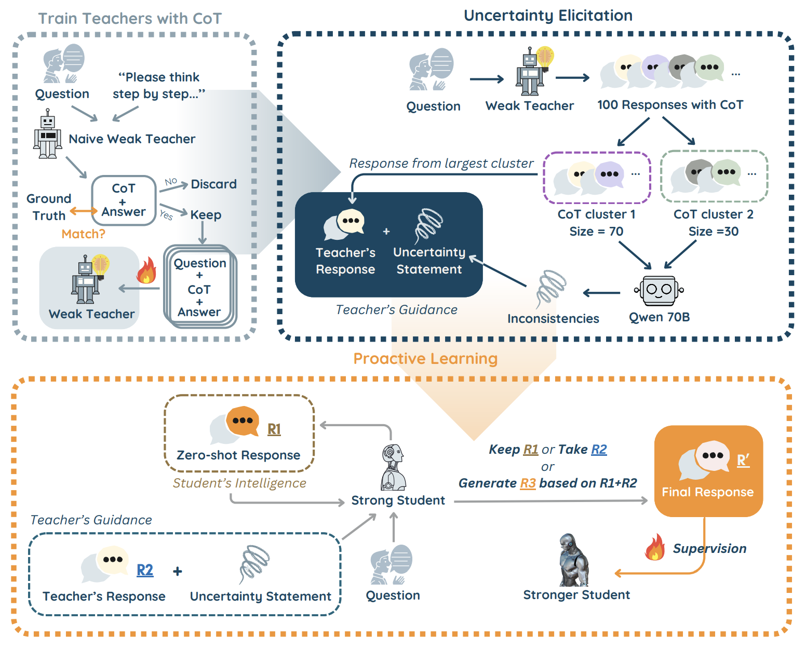

# Alice: Proactive Learning with Teacher's Demonstrations for Weak-to-Strong Generalization🐇

## 🪴Overview
We introduce Alice, a new wrak-to-strong generalization framework that fully utilizes both teacher and student models’ intelligence and enables them to complement each other’s knowledge, finally achieving superior generazalition outcome. Alice starts by probing the real knowledge base of weak teacher models through uncertainty expression. Students are then instructed to leverage both the teacher's task-specific guidance and its own superior capabilities to self-generate higher-quality responses, which serve as training supervisions later. For scenarios with substantial capability gaps between teacher and student models, we also introduce cascade Alice, a multi-stage iterative weak-to-strong supervision framework that uses weak teachers to guide intermediate models, which then serve as teachers for stronger models, enabling more stable knowledge transfer.



## 🪵Requirements
1. The required Python packages for running this repo are listed in [requirements.txt](./requirements.txt). To install these pacakages at one time, plaese run
```shell
pip install -r requirements.txt
```

2. You also need to set up variable `HF_token`(your Huggingface access token) in most scripts.
3. Model `./Meta-Llama-3-70B-Instruct` is used in our weak-to-strong generalization pipeline, and you may need to download it from [Huggingface](https://huggingface.co/meta-llama/Meta-Llama-3-70B) and store it under folder `Alice` before getting started.
   
Note: We have preprocessed the `ARC_challenge` dataset for easier use later. The processed dataset has already been included in the folder at [arc_challenge_processed](.arc_challenge_processed).


## 🐾CoT Generation
As a step one, we'll need to generate CoT for each q-a pair for datasets that only comes with ground truth answer label: HotpotQA, TriviaQA, and ARC_challenge. The scripts are stored in folder [cot](./cot_generate_filter). You need to specify the following command line argument when running the scripts: 
1) `--data`: Choose from 'hotpotqa', 'triviaqa', and 'arc_challenge'.
2) `--model`: Choose from 'qwen2.5' and 'llama3'
3) `--teacher`: The size of the teacher model. Choose from '1.5B' and '3B' when you specify 'qwen2.5' for model, and choose from '1B' and '3B' when you do 'llama3'.

Here is an example. To generate the CoT reasoning content that matched the ground truth answer for dataset 'TriviaQA' of the teacher model 'Llama3 1B', you should run:
```shell
python cot/cot_generate_filter.py --model llama3 --data triviaqa --teacher 1B
```
The generated data will be stored in a new folder `./data/CoT` fter running the scripts. 


## 🧚🏻Training Teacher Models with CoT
Next, we'll use the first half of the dataset to train teacher models so that they are equipped with basic domain knowledge. You'll need to run the scripts in folder [training](./training/SFT.py). (You can change the batch size in [accelerate_config.yaml](./training/accelerate_config.yaml) every time you run the SFT script.)
For our new method, we need to train teacher models with CoT. You need to specify the following command line argument when running the scripts: 
1) `--data`: Choose from 'hotpotqa', 'triviaqa', 'gsm8k' and 'arc_challenge'
2) `--model`: Choose from 'qwen2.5' and 'llama3'
3) `--teacher`: The size of the teacher model. Choose from '1.5B' and '3B' when you specify 'qwen2.5' for model, and choose from '1B' and '3B' when you do 'llama3'
4) `--method`: You should use 'ours-wts-stage1'
5) `--our-wts-type`: You should use 'singleturn'

For the original W2S method, we have two separate settings: train teachers with CoT or with q-a pair only. For the CoT one, it's the same as the stage 1 for our approach, so you just need to follow the instructions above. (You just need to run it once and the output models can be used for both settings). For the qa one, you should follow the instructions above for the first three arguments and made the following changes to the last two:
1) `--method`: You should use 'original-wts-stage1'
2) `--original-wts-type`: You should use 'qa'

After running the scripts, the model outputs will be stored in a new folder `./model_outputs`.

## 🪺Original W2SG
There are two steps in the original W2SG pipeline: 1. get the training signals from teacher models, 2. use these signals to train studnet models.
For step one, you'll run the script [original_weak_to_strong.py](./W2SG_pipeline/original/original_weak_to_strong.py). You need to specify the arguments `--data`, `--model`, `--teacher` as usual, and additionally, `--type` by choosing from 'qa' and 'cot', which represents different teacher model types that are trained using either CoT or answer only. 
Example: to get the training signals from teacher model llama3 1B trained using CoT for dataset arc_challenge, you'll run:
```shell
python W2SG_pipeline/original/original_weak_to_strong.py --model llama3 --data arc_challenge --teacher 1B --type cot
```

Next, for step two, you need to run script [SFT.py](./training/SFT.py) to train student models with teacher's signals. You should specify the argument `--method` with 'original-wts-stage2' and choose either 'qa' or 'cot' for argument `--original-wts-type`. For example, following the above step, you may run:
```shell
python training/SFT.py --model llama3 --data arc_challenge --teacher 1B --student 3B --method original-wts-stage2 --original-wts-type cot
```

## 🍄New W2SG - Alice
Similar to the original W2SG, we have two steps for our method as well. For the first step, we go through the whole sampling and clustering, uncertianty summarization, zero-shot inference, proactive learning process. Each process is implemented in different file. For easier impletation, we prepare a [sh script](./W2SG_pipeline/ours/ours-wts-single.sh) that you can directly use to run those files in correct order automatically. You need to change the arguments `--data`, `--model`, `--teacher`, `--student` to fit different settings. Then you can simply run:
```shell
./W2SG_pipeline/ours/ours-wts-single.sh
```

For step two, it's the same as the one for original W2SG. Just set the argument `--method` to 'ours-wts-stage2' and `--ours-wts-type` to 'singleturn'.

To implement Cascade Alice(teacher model - midlevel model- student model), we recommend you to run normal Alice on setting '1.5B teaches 3B' for qwen2.5 and '1B teaches 3B' for llama3 first (teacher model - midlevel model), so that you can directly reuse the data for the first stage or Cascade Alice here. 

If you already did that, you can directly do the midlevel model training by running the script SFT.py. Here you should set the argument `--ours-wts-type` to 'cascade1', specify the teacher model size in argument `--teacher` and midlevel model size in argument `--student`. 

Next, you should run another [sh script](./W2SG_pipeline/ours/ours-wts-cascade.sh) for the 'midlevel model - student model' process. Similarly, you need to change the corresponding arguments and then you can directly run the sh file. 

Finally, train the student model by running SFT scripts. Here, set the argument `--ours-wts-type` to 'cascade2', specify the midlevel model size in argument `--teacher` and student model size in argument `--student`. In conclusion, you may run the following:
```shell
python training/SFT.py --model qwen2.5 --data hotpotqa --teacher 1.5B --student 3B --method ours-wts-stage2 --ours-wts-type cascade1 
./W2SG_pipeline/ours/ours-wts-cascade.sh
python training/SFT.py --model qwen2.5 --data hotpotqa --teacher 3B --student 7B --method ours-wts-stage2 --ours-wts-type cascade2
```

## 🍃Baselines: Weak/Strong Performance
We train weak teacher/strong students using last half of ground truth label for each dataset. The evaluation results are taken as the weak/strong performance, which serve as the baselines in this work. You can simply run the [SFT.py](./training/SFT.py) scripts by setting the argument `--method` as 'base' and specifying the weak/strong model size in argument `--student`. For instance, if you want to get the weak teacher performance for qwen2.5 1.5B on gsm8k dataset, you may run:
```shell
python training/SFT.py --model qwen2.5 --data gsm8k --student 1.5B --method base
```

## 🐚Evaluation
Now you are finally towards the evaluation stage! Just simply run the script [evaluation.py](./evaluation/evaluate.py) and specify the arguments accordingly. A final summarization of those arguments:
1) `--data`: Choose from 'hotpotqa', 'triviaqa', 'gsm8k' and 'arc_challenge'.
2) `--model`: Choose from 'qwen2.5' and 'llama3'
3) `--teacher`: The size of the teacher model. Choose from '1.5B' and '3B' when you specify 'qwen2.5' for model, and choose from '1B' and '3B' when you do 'llama3'
4) `--student`: The size of the student model. Choose from '3B' and '7B' when you specify 'qwen2.5' for model, and choose from '3B' and '8B' when you do 'llama3'
5) `--method`: Choose from 'original-wts' and 'ours-wts'
6) `--our-wts-type`: Used when you specify 'ours-wts' for method. Choose from 'singleturn' and 'cascade'
7) `--original-wts-type`: Used when you specify 'original-wts' for method. Choose from 'qa' and 'cot'


